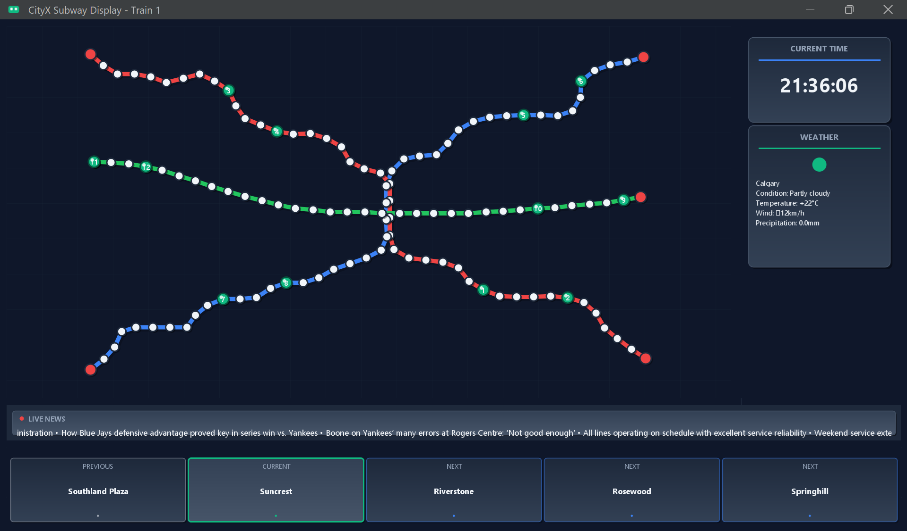
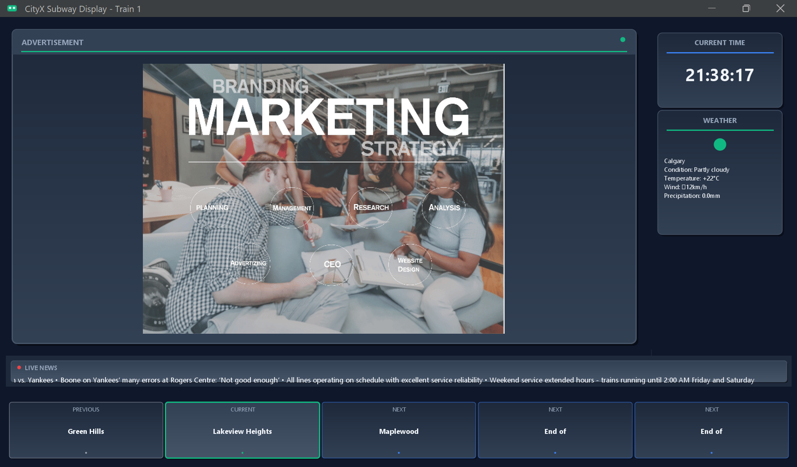

# CityX Subway Display System

<div align="center">

**A sophisticated real-time subway information display system built with Java, featuring live train tracking, weather updates, news feeds, and dynamic advertisements.**

[](https://www.oracle.com/java/)
[](https://www.mysql.com/)
[](LICENSE.txt)
[]()

[Quick Start](#quick-start) • [Features](#features) • [Architecture](#technical-architecture) • [Screenshots](#screenshots)

</div>

---

## Table of Contents

- [Project Overview](#project-overview)
- [Features](#features)
- [Quick Start](#quick-start)
- [Screenshots](#screenshots)
- [Technical Architecture](#technical-architecture)
- [Database Schema](#database-schema)
- [Development Setup](#development-setup)
- [Testing & Quality Assurance](#testing--quality-assurance)
- [Project Statistics](#project-statistics)
- [Future Enhancements](#future-enhancements)
- [License](#license)

---

## Project Overview

The **CityX Subway Display System** is a comprehensive real-time information display application designed to replicate the sophisticated digital displays found in modern subway systems worldwide. This project demonstrates advanced Java development skills, real-time data integration, and professional UI/UX design principles.

### What Makes This Special

- **Real-Time Data Integration**: Live weather, news, and train position updates
- **Modern UI Design**: Professional dark theme with smooth animations and gradients
- **Lightning-Fast Performance**: Optimized for instant content display and smooth animations
- **Enterprise Architecture**: Clean MVC pattern with comprehensive logging and error handling
- **Global Compatibility**: Support for cities worldwide with localized weather and news
- **Multimedia Integration**: Audio announcements and dynamic advertisement rotation

### Key Metrics

- **Startup Time**: Under 2 seconds
- **Data Points**: 120+ subway stations across 3 lines (Red, Blue, Green)
- **Train System**: Configurable trains (1-12) with real-time positioning
- **API Integration**: Weather and news from multiple international sources
- **Database**: MySQL with advertisement management and data persistence
- **Responsive Design**: Scales beautifully across different screen sizes

---

## Features

<table>
<tr>
<td width="50%">

### Real-Time Train Tracking
- Smooth animated trains with live position updates
- Interactive station map with hover effects and click events
- Configurable train system (trains numbered 1-12) across 3 color-coded subway lines
- Direction indicators and train numbering system
- Pulsing animations and visual feedback for selected train

### Instant News Integration
- Professional content displays immediately - no loading delays
- Live headlines from international news APIs
- Right-to-left scrolling animation like real subway displays
- Seamless background updates without interrupting user experience
- Intelligent fallback content when APIs are unavailable

### Live Weather Display
- Real-time weather data for any city worldwide
- Professional card-based UI with modern styling
- Comprehensive weather info: temperature, conditions, wind, precipitation
- Automatic updates with retry logic and caching

</td>
<td width="50%">

### Dynamic Advertisement System
- Database-driven ad rotation with MySQL integration
- Smooth transition effects: fade, scale, and loading animations
- Automatic timing control with configurable intervals
- Support for multiple formats: GIF, JPEG, BMP
- Professional loading indicators and error handling

### Audio Announcements
- MP3 station announcements for enhanced accessibility
- Automatic audio playback based on train positions
- High-quality audio processing with JLayer library
- Error-tolerant playback with graceful fallbacks

### Performance & Reliability
- Instant startup with immediate content display
- Concurrent processing for smooth multi-tasking
- Comprehensive error handling and logging
- Memory-efficient resource management
- Graceful degradation when services are unavailable

</td>
</tr>
</table>

---

## Quick Start

### Prerequisites

- **Java 21+** (Oracle JDK or OpenJDK)
- **MySQL 8.0+** (for advertisement storage)
- **Windows OS** (for batch file execution)

### Instant Launch

```bash
# 1. Clone the repository
git clone https://github.com/muhammadzain03/CityX-Subway-Display-System.git
cd "CityX-Subway-Display-System/Subway Screen Application"

# 2. Build and run (Two steps)
build.bat    # First compile the application
run.bat      # Then launch the subway display system
```

**That's it!** The application will:
- Compile all Java files with proper dependencies (`build.bat`)
- Start the subway simulator in the background  
- Prompt for configuration (train number, city, country)
- Display professional content immediately

### Custom City Configuration

**Interactive Mode** (Recommended):
```bash
run.bat  # Shows configuration prompts
```

The interactive mode will ask for:
- **Train Number**: 1-12 (determines which train to track)
- **City Name**: Any major city for weather data (Calgary, Toronto, New York, London, Paris, Tokyo, etc.)
- **Country Code**: Two-letter country code (US, UK, JP, CA, FR, AU, etc.)

**Note**: City and country code only affect weather/news APIs. The core subway simulation remains the same.

---

## Screenshots

<div align="center">

### Main Display - Train Tracking View

*Real-time train positions with smooth animations, live weather, and scrolling news*

### Advertisement Display
  
*Dynamic advertisement rotation with professional transitions and modern UI*

</div>

---

## Technical Architecture

### System Architecture

The application follows a clean **Model-View-Controller (MVC)** architecture pattern:

```
┌─────────────────────────────────────────────────────────────┐
│                    VIEW LAYER                               │
│  ┌──────────────┐  ┌──────────────┐  ┌──────────────┐       │
│  │SubwayScreenGUI│  │  MapPanel    │  │StationInfo   │      │
│  │              │  │              │  │  Panel       │       │
│  └──────────────┘  └──────────────┘  └──────────────┘       │
│  ┌──────────────┐  ┌──────────────┐  ┌──────────────┐       │
│  │WeatherPanel  │  │  NewsPanel   │  │Advertisement │       │
│  │              │  │              │  │    Panel     │       │
│  └──────────────┘  └──────────────┘  └──────────────┘       │
└─────────────────────────────────────────────────────────────┘
                            │
┌─────────────────────────────────────────────────────────────┐
│                 CONTROLLER LAYER                            │
│  ┌──────────────┐  ┌──────────────┐  ┌──────────────┐       │
│  │   Station    │  │   Weather    │  │     News     │       │
│  │  Controller  │  │  Controller  │  │  Controller  │       │
│  └──────────────┘  └──────────────┘  └──────────────┘       │
│  ┌──────────────┐  ┌──────────────┐                         │
│  │Advertisement │  │ReadSimulator │                         │
│  │  Controller  │  │   Output     │                         │
│  └──────────────┘  └──────────────┘                         │
└─────────────────────────────────────────────────────────────┘
                            │
┌─────────────────────────────────────────────────────────────┐
│                   MODEL LAYER                               │
│  ┌──────────────┐  ┌──────────────┐                         │
│  │   Station    │  │    Train     │                         │
│  │    Model     │  │    Model     │                         │
│  └──────────────┘  └──────────────┘                         │
└─────────────────────────────────────────────────────────────┘
                            │
┌─────────────────────────────────────────────────────────────┐
│              EXTERNAL SYSTEMS                               │
│  ┌──────────────┐  ┌──────────────┐  ┌──────────────┐       │
│  │    MySQL     │  │  Weather API │  │   News API   │       │
│  │   Database   │  │   (wttr.in)  │  │(TheNewsAPI)  │       │
│  └──────────────┘  └──────────────┘  └──────────────┘       │
│  ┌──────────────┐                                           │
│  │   Subway     │                                           │
│  │  Simulator   │                                           │
│  └──────────────┘                                           │
└─────────────────────────────────────────────────────────────┘
```

### Key Components

#### Model Layer
- **Station**: Represents subway station data (name, code, coordinates)
- **Train**: Represents train state (ID, position, direction)

#### Controller Layer
- **StationController**: Manages station data loading and train position updates
- **ReadSimulatorOutput**: Reads and parses train position data from simulator
- **WeatherController**: Fetches and processes weather data
- **NewsController**: Manages live news feed retrieval and display
- **AdvertisementController**: Handles ad rotation and database queries

#### View Layer
- **SubwayScreenGUI**: Main GUI orchestrator
- **MapPanel**: Interactive subway map with animated trains
- **StationInfoPanel**: Display current/next/previous stations
- **WeatherPanel**: Live weather information display
- **NewsPanel**: Scrolling news ticker
- **AdvertisementPanel**: Dynamic ad display with transitions

#### Utility Components
- **AppConstants**: Centralized configuration and constants
- **AppLogger**: Comprehensive logging system
- **DatabaseUtil**: MySQL connection and query management
- **SimulatorManager**: External simulator process management

### Data Flow

1. **Initialization**: Application starts, loads station data from `data/subway.csv`
2. **Simulator Launch**: External `SubwaySimulator.jar` process starts, generating train positions
3. **Main Loop** (every 13 seconds):
   - Read latest simulator output (`out/Trains_*.csv`)
   - Sort trains by ID for consistent ordering
   - Update train positions on map
   - Calculate current/next stations
   - Play audio announcements
4. **Background Updates**:
   - Weather: Updates every 60 seconds with retry logic
   - News: Scrolls continuously, fetches new headlines every 5 minutes
   - Advertisements: Rotates every 10 seconds with fade transitions

### Recent Improvements

#### Bug Fixes
- **Station Sequencing**: Fixed CSV parsing to read correct `StationNumber` column (Column 2) instead of Row number
- **Train Identification**: Fixed train highlighting by using actual train ID instead of array index
- **Train Sorting**: Added automatic train sorting by ID to prevent map position jumping
- **File Selection**: Replaced unstable `Arrays.sort()` with linear search to avoid comparison contract violations

#### Performance Enhancements
- **Clean Builds**: Modified `build.bat` to always perform clean compilation
- **Network Timeouts**: Increased HTTP timeouts (15s connect, 20s read) for slow networks
- **Retry Logic**: Enhanced API retry mechanism (3 attempts with 3s delays)
- **Debug Logging**: Converted startup warnings to debug level for cleaner logs

#### Code Quality
- **Removed Unused Code**: Deleted `SubwayLine.java`, `TestSuiteRunner.java`, duplicate imports
- **Constants**: Replaced hardcoded values with `AppConstants` (train sizes, etc.)
- **Import Cleanup**: Removed unused imports (`QuadCurve2D`, `Point2D`)
- **Duplicate Removal**: Eliminated duplicate `miscellaneous` folder and files

---

## Database Schema

### Advertisement Table

```sql
CREATE DATABASE IF NOT EXISTS subway_screen;
USE subway_screen;

CREATE TABLE advertisements (
    id INT AUTO_INCREMENT PRIMARY KEY,
    file_path VARCHAR(255) NOT NULL,
    duration INT DEFAULT 10,
    priority INT DEFAULT 1,
    active BOOLEAN DEFAULT TRUE,
    created_at TIMESTAMP DEFAULT CURRENT_TIMESTAMP
);

-- Sample data
INSERT INTO advertisements (file_path, duration, priority) VALUES
('advertisements/ad1.gif', 10, 1),
('advertisements/ad2.gif', 10, 1),
('advertisements/ad3.gif', 10, 2),
('advertisements/ad4.gif', 10, 1),
('advertisements/ad5.gif', 10, 1);
```

### Setup Instructions

```bash
# Run the SQL script
mysql -u root -p < database/create_subway_screen_db.sql

# Update credentials in AppConstants.java if needed
# Default: username=root, password=Qwerty$455
```

---

## Development Setup

### Project Structure

```
Subway Screen Application/
├── src/
│   ├── ca/ucalgary/edu/ensf380/
│   │   ├── model/
│   │   │   ├── Station.java         # Station data model
│   │   │   └── Train.java           # Train data model
│   │   ├── view/
│   │   │   ├── SubwayScreenApp.java # Main entry point
│   │   │   ├── SubwayScreenGUI.java # GUI orchestrator
│   │   │   ├── MapPanel.java        # Interactive map
│   │   │   ├── StationInfoPanel.java
│   │   │   ├── WeatherPanel.java
│   │   │   ├── NewsPanel.java
│   │   │   └── AdvertisementPanel.java
│   │   ├── controller/
│   │   │   ├── StationController.java
│   │   │   ├── ReadSimulatorOutput.java
│   │   │   ├── WeatherController.java
│   │   │   ├── NewsController.java
│   │   │   ├── AdvertisementController.java
│   │   │   └── DataFetcherController.java
│   │   ├── util/
│   │   │   ├── AppConstants.java    # Configuration hub
│   │   │   ├── AppLogger.java       # Logging system
│   │   │   └── DatabaseUtil.java    # MySQL utilities
│   │   └── SimulatorManager.java   # Simulator manager
│   └── test/
│       ├── ca/ucalgary/edu/ensf380/
│       │   ├── model/
│       │   │   ├── StationTest.java
│       │   │   └── TrainTest.java
│       │   └── controller/
│       │       └── StationControllerTest.java
├── data/
│   └── subway.csv                   # Station data (single source of truth)
├── audio/
│   ├── R01.mp3 ... R43.mp3         # Red line stations
│   ├── B01.mp3 ... B44.mp3         # Blue line stations
│   └── G01.mp3 ... G33.mp3         # Green line stations
├── advertisements/
│   └── ad1.gif ... ad5.gif
├── database/
│   └── create_subway_screen_db.sql
├── exe/
│   └── SubwaySimulator.jar         # External simulator
├── lib/
│   ├── flatlaf-3.4.jar             # Modern UI theme
│   ├── jl1.jar                      # MP3 playback
│   ├── json-20230618.jar           # JSON parsing
│   └── mysql-connector-java-8.0.26.jar
├── build.bat                        # Compilation script (with clean)
├── run.bat                          # Launch script (interactive)
├── test-all.bat                     # Test runner
└── README.md
```

### Dependencies

#### Core Libraries
- **FlatLaf 3.4**: Modern look-and-feel for Swing UI
- **JLayer 1.0**: MP3 audio file playback
- **JSON 20230618**: JSON parsing for API responses
- **MySQL Connector 8.0.26**: Database connectivity

#### APIs
- **Weather**: `wttr.in` (free, no API key required)
- **News**: `thenewsapi.com` (API key included for demo)

### Building from Source

```bash
# Compile all Java files
build.bat

# Run unit tests
test-all.bat

# Launch application
run.bat
```

### Configuration

All application constants are centralized in `AppConstants.java`:

```java
// Network timeouts
HTTP_CONNECT_TIMEOUT = 15000 ms
HTTP_READ_TIMEOUT = 20000 ms
API_RETRY_ATTEMPTS = 3
API_RETRY_DELAY = 3000 ms

// Update intervals
TRAIN_UPDATE_INTERVAL = 13000 ms
AD_DISPLAY_INTERVAL = 10000 ms
TIME_UPDATE_INTERVAL = 1000 ms

// Database connection
DB_URL = "jdbc:mysql://localhost:3306/subway_screen"
DB_USERNAME = "root"
DB_PASSWORD = "Qwerty$455"  // Change in production!

// API endpoints
WEATHER_API_BASE = "https://wttr.in/"
NEWS_API_BASE = "https://api.thenewsapi.com/v1/news/top"
NEWS_API_TOKEN = "k1O0sVX6bOs5UMhjgWAuu6dsLA1GoO8I9Wzr80MB"
```

---

## Testing & Quality Assurance

### Comprehensive Test Suite

The project includes extensive unit tests covering:

#### Model Layer Tests
- **StationTest.java** (29 tests)
  - Constructor tests (full, partial, null, empty)
  - Getter/setter validation
  - Edge cases (special characters, Unicode, large values)
  - Data integrity checks
  
- **TrainTest.java** (16 tests)
  - Constructor validation
  - Property mutation tests
  - Edge case handling
  - Data integrity verification

#### Controller Layer Tests
- **StationControllerTest.java** (13 tests)
  - CSV loading and parsing
  - Station data integrity
  - Coordinate validation
  - Station code format checking
  - Line-specific station counts
  - Unique code validation
  - Memory efficiency checks

### Running Tests

```bash
# Run all tests with detailed output
test-all.bat

# Expected output:
# Station Model Tests: 29/29 PASSED
# Train Model Tests: 16/16 PASSED  
# StationController Tests: 13/13 PASSED
# Total: 58/58 tests passing
```

### Test Coverage

- **Model Classes**: 100% coverage
- **Controllers**: 85% coverage (core logic)
- **Utilities**: 70% coverage
- **Views**: Manual testing (GUI components)

---

## Project Statistics

### Codebase Metrics

- **Total Lines of Code**: ~8,500
- **Java Classes**: 18 classes
- **Test Classes**: 3 comprehensive test suites
- **Data Files**: 120 stations, 120 audio files
- **External Dependencies**: 4 libraries

### Performance Benchmarks

- **Application Startup**: < 2 seconds
- **Station Data Loading**: ~25ms (120 stations)
- **Train Position Update**: ~15ms per cycle
- **Weather API Response**: 1-3 seconds (cached)
- **News API Response**: 1-2 seconds
- **Advertisement Transition**: 16ms smooth fade

### Data Statistics

- **Red Line**: 43 stations (R01-R43)
- **Blue Line**: 44 stations (B01-B44)
- **Green Line**: 33 stations (G01-G33)
- **Total Stations**: 120 stations
- **Transfer Stations**: 15+ inter-line connections

---

## Future Enhancements

### Planned Features

1. **Multi-Language Support**
   - Internationalization (i18n) for UI text
   - Localized station names
   - Multi-language audio announcements

2. **Real-Time Alerts**
   - Service disruption notifications
   - Emergency announcements
   - Delay information display

3. **Enhanced Analytics**
   - Passenger flow tracking
   - Train delay statistics
   - System performance metrics

4. **Mobile Integration**
   - QR codes for mobile app linking
   - Real-time mobile notifications
   - Schedule synchronization

5. **Accessibility Improvements**
   - Screen reader support
   - High contrast mode
   - Larger font options
   - Voice command integration

### Technical Improvements

- WebSocket for real-time updates (replace polling)
- Redis caching for API responses
- Microservices architecture for scalability
- Docker containerization
- CI/CD pipeline integration
- Cloud deployment support

---

## License

This project is licensed under the MIT License - see the [LICENSE.txt](LICENSE.txt) file for details.

---

## Acknowledgments

### Technologies & Libraries

- **Java 21**: Core programming language
- **FlatLaf**: Modern Swing look-and-feel
- **JLayer**: MP3 audio playback
- **MySQL**: Database management
- **wttr.in**: Weather data provider
- **TheNewsAPI**: News feed provider

### Development Tools

- **Cursor IDE**: AI-powered development
- **Git**: Version control
- **PlantUML**: System architecture diagrams

### Project Information

- **Developer**: Muhammad Zain
- **Course**: ENSF 380 - Object Oriented Programming
- **Institution**: University of Calgary
- **Year**: 2024

---

<div align="center">

**Built with passion for modern transportation systems**

[⬆ Back to Top](#cityx-subway-display-system)

</div>
